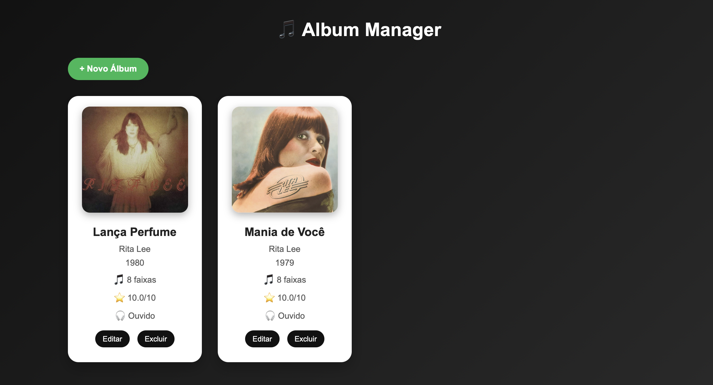
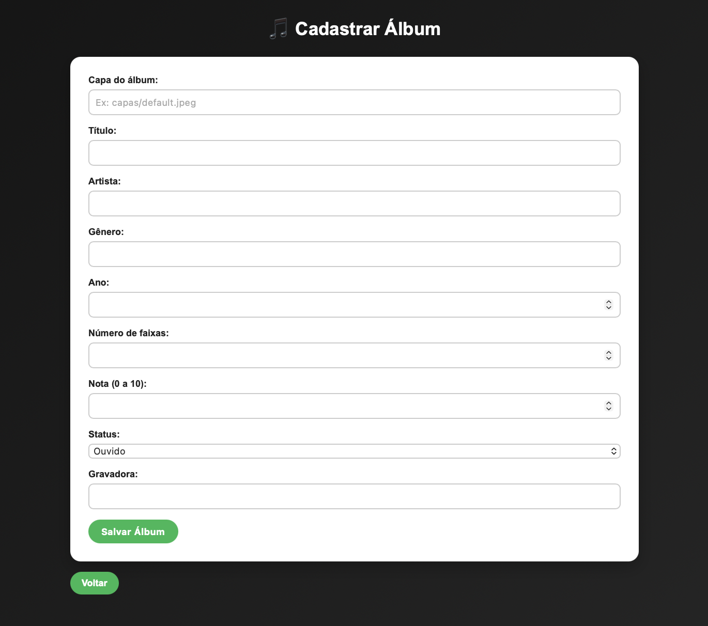
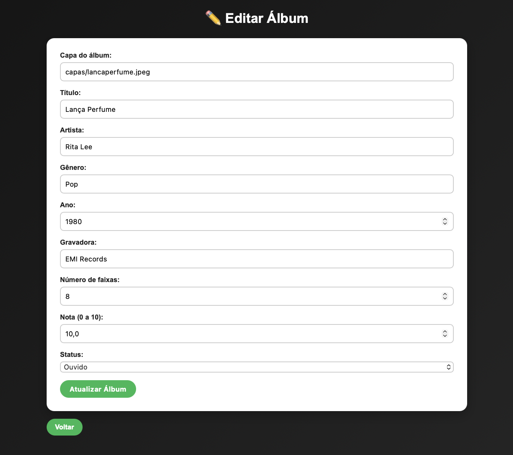

# 🎵 Album Manager

Aplicação CRUD para gerenciamento de álbuns musicais, desenvolvida em PHP e MySQL.

O projeto permite cadastrar, visualizar, editar e excluir álbuns, além de armazenar informações como capa, artista, gênero, número de faixas, avaliação e status de reprodução.

---

## 🛠️ Tecnologias

- PHP
- MySQL
- HTML5
- CSS3
- XAMPP
- Git/GitHub

---

## ✨ Funcionalidades

- Cadastro de álbuns
- Visualização em cards com capa
- Edição de informações
- Exclusão de álbuns
- Avaliação dos álbuns (0 a 10)
- Controle de status:
  - Ouvido
  - Quero ouvir
- Número de faixas
- Validação de dados
- Mensagens de feedback ao usuário

---

## 📁 Estrutura do projeto

```text
album-manager/

├── assets/          # Imagens utilizadas no README
├── capas/           # Capas dos álbuns
├── css/             # Estilos da aplicação
├── database/        # Script do banco de dados
│   └── banco.sql
├── includes/        # Arquivos auxiliares
│   └── conexao.php
│
├── index.php        # Listagem dos álbuns
├── novo.php         # Formulário de cadastro
├── salvar.php       # Inserção no banco
├── editar.php       # Formulário de edição
├── atualizar.php    # Atualização no banco
└── excluir.php      # Remoção de registros
```

---

## 🚀 Como executar

### Pré-requisitos

- PHP
- MySQL
- XAMPP

### Instalação

1. Clone o repositório:

```bash
git clone URL_DO_REPOSITORIO
```

2. Mova a pasta do projeto para:

```
xampp/htdocs
```

3. Inicie o Apache e MySQL pelo XAMPP.

4. Importe o arquivo:

```
database/banco.sql
```

no phpMyAdmin.

5. Caso necessário, ajuste as credenciais do banco em:

```
includes/conexao.php
```

6. Acesse:

```
http://localhost/album-manager
```

---

## 📸 Preview

### Tela inicial



### Cadastro de álbum



### Edição de álbum



---

## 👨‍💻 Desenvolvido por

Emanuel